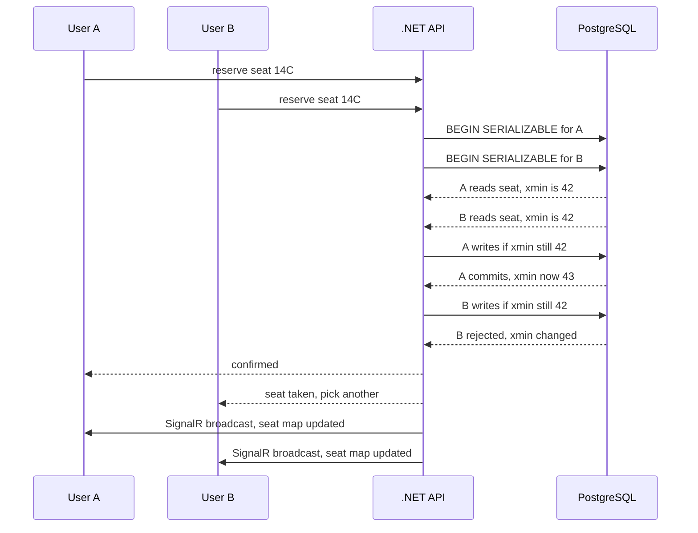
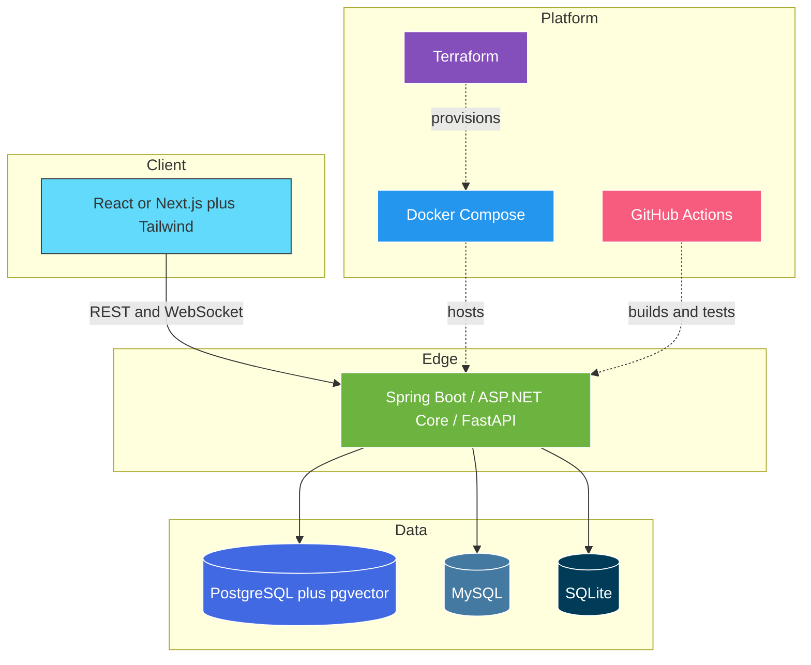

  

  

**👇 Click any section below to expand it — this README is meant to be clicked through, not scrolled past.**

## 🧭 Start Here — Pick Your Path

<table>
<tr>
<td width="33%" valign="top">

<b>👔 Hiring / Recruiting</b>

 

**TL;DR** — Backend-leaning full-stack developer. Java & .NET for services, Python for AI systems, TypeScript on the front.

**Strongest evidence of depth:**
1. [SLangJava](https://github.com/Amithkrishna29z/SLangJava) — a working compiler, 174 tests pinned against a reference implementation
2. [dotnet-seat-wave](https://github.com/Amithkrishna29z/dotnet-seat-wave) — real concurrency control, not CRUD
3. [documind](https://github.com/Amithkrishna29z/documind-multi-agent-document-intelligence) — production-shaped AI architecture

**Also worth knowing:** 98 public repos across 12 languages, consistently maintained since 2022.

</td>
<td width="33%" valign="top">

<b>🧑‍💻 Fellow Engineer</b>

 

**The ones with actual ideas in them:**

- **[SLangJava](https://github.com/Amithkrishna29z/SLangJava)** — ANTLR front end → type checker → tree-walking interpreter → Java codegen. Porting a compiler teaches you where a spec is actually ambiguous.
- **[mini-rate-limiter](https://github.com/Amithkrishna29z/mini-rate-limiter)** — token bucket, thread-safe, small enough to read in one sitting.
- **[jython-plugin-engine](https://github.com/Amithkrishna29z/jython-plugin-engine)** — embedding a Python runtime in a JVM app for hot-loadable plugins.
- **[java-byteCode-engineering](https://github.com/Amithkrishna29z/java-byteCode-engineering)** — bytecode manipulation.
- **[java-jni](https://github.com/Amithkrishna29z/java-jni)** — crossing the JVM/native boundary.

</td>
<td width="33%" valign="top">

<b>🍿 Just Browsing</b>

 

My GitHub bio is `git commit -m "Hope this works"` and I stand by it.

**Fun corners of this account:**
- [story](https://github.com/Amithkrishna29z/story) — described, in earnest, as "my masterpiece"
- [learn-git](https://github.com/Amithkrishna29z/learn-git) — "a test to learn git"
- [express-digi](https://github.com/Amithkrishna29z/express-digi) — "just a test repo"
- [7-levels-of-knowledge](https://github.com/Amithkrishna29z/7-levels-of-knowledge)
- [free-medium](https://github.com/Amithkrishna29z/free-medium)

Somewhere in these 98 repos is a `volkswagen` repo. I'm not explaining it.

</td>
</tr>
</table>

## 🐍 Watch My Commits Get Eaten

<picture>
  <source media="(prefers-color-scheme: dark)" srcset="https://raw.githubusercontent.com/Amithkrishna29z/Amithkrishna29z/output/snake-dark.svg"/>
  <source media="(prefers-color-scheme: light)" srcset="https://raw.githubusercontent.com/Amithkrishna29z/Amithkrishna29z/output/snake-light.svg"/>
  
</picture>

🔄 Regenerated automatically every 12 hours by <a href="https://github.com/Amithkrishna29z/Amithkrishna29z/actions">GitHub Actions</a> — this image is never the same twice.

## 🚀 Featured Projects

> Each card below has an expandable deep-dive showing how the thing actually works.

<table>
<tr>
<td width="50%" valign="top">

### 🧠 [documind](https://github.com/Amithkrishna29z/documind-multi-agent-document-intelligence)
Multi-agent RAG platform with a corrective retrieval pipeline and streamed, cited answers.

</td>
<td width="50%" valign="top">

### 🎟️ [dotnet-seat-wave](https://github.com/Amithkrishna29z/dotnet-seat-wave)
Event ticketing with a seat engine that refuses to double-book under load.

</td>
</tr>
</table>

<b>🔍 How documind's corrective-RAG pipeline works</b>

 

A plain RAG system answers confidently from bad context. This one grades its own retrieval and backs out when the context is weak.

**The two decision points are the whole idea.** The *relevance grader* catches weak retrieval before it reaches the model, and the *hallucination check* catches ungrounded output before it reaches the user — looping back rather than shipping a confident guess.

Stack: LangGraph orchestration · FastAPI · PostgreSQL + pgvector · typed React/Vite frontend with a live agent-status timeline.

<b>🔍 How seat-wave prevents double-booked seats</b>

 

Two people click the same seat in the same millisecond. Exactly one may win.

`SERIALIZABLE` isolation plus PostgreSQL's `xmin` system column gives optimistic concurrency without a distributed lock. Losers get a clean rejection, and every connected client's seat map updates live over SignalR.

<table>
<tr>
<td width="50%" valign="top">

### ⚙️ [SLangJava](https://github.com/Amithkrishna29z/SLangJava)
Java port of the SlangSharp (ARLang) compiler — **174 tests** pinned against the original .NET implementation.

</td>
<td width="50%" valign="top">

### 🗂️ [realtime-kanban](https://github.com/Amithkrishna29z/mern-realtime-collaborative-kanban-board)
Collaborative Trello-style board with live multi-user sync over WebSockets.

</td>
</tr>
<tr>
<td width="50%" valign="top">

### 🛠️ [springcli](https://github.com/Amithkrishna29z/springcli)
Cross-platform Java 21 CLI that scaffolds Spring Boot projects via the Spring Initializr API.

</td>
<td width="50%" valign="top">

### 🚦 [mini-rate-limiter](https://github.com/Amithkrishna29z/mini-rate-limiter)
Thread-safe token-bucket rate limiter — a clean concurrency primitive, fully tested.

</td>
</tr>
</table>

<b>🔍 How a compiler fits together front-to-back (SLangJava)</b>

 

One front end, two back ends: the same type-checked AST either runs immediately through the interpreter or lowers to Java source. The 174 tests exist because a port is only correct if it disagrees with the original *nowhere*.

<b>📂 Browse all 98 repositories by theme</b>

 

> **🔌 Backend & APIs** — [spendlog](https://github.com/Amithkrishna29z/spendlog) · [dotnet-minimal-api-gamestore](https://github.com/Amithkrishna29z/dotnet-minimal-api-gamestore) · [rust-todo-api](https://github.com/Amithkrishna29z/rust-todo-api) · [dotnet-url-shortener](https://github.com/Amithkrishna29z/dotnet-url-shortener) · [python-fast-api-url-shortener-analytics](https://github.com/Amithkrishna29z/python-fast-api-url-shortener-analytics) · [springboot-graphql](https://github.com/Amithkrishna29z/springboot-graphql) · [java-grpc](https://github.com/Amithkrishna29z/java-grpc)

> **🧬 Systems & internals** — [linux-internals](https://github.com/Amithkrishna29z/linux-internals) · [connect-c-to-sqlite](https://github.com/Amithkrishna29z/connect-c-to-sqlite) · [java-jni](https://github.com/Amithkrishna29z/java-jni) · [java-byteCode-engineering](https://github.com/Amithkrishna29z/java-byteCode-engineering) · [tiny-c-plus-plus](https://github.com/Amithkrishna29z/tiny-c-plus-plus) · [java-CompletableFuture](https://github.com/Amithkrishna29z/java-CompletableFuture)

> **🏛️ Architecture & extensibility** — [jython-plugin-engine](https://github.com/Amithkrishna29z/jython-plugin-engine) · [java-plugin-architecture](https://github.com/Amithkrishna29z/java-plugin-architecture) · [clean-architecture](https://github.com/Amithkrishna29z/clean-architecture) · [design-patterns](https://github.com/Amithkrishna29z/design-patterns) · [solid-principles](https://github.com/Amithkrishna29z/solid-principles)

> **🤖 AI & tooling** — [python-google-search-mcp-server](https://github.com/Amithkrishna29z/python-google-search-mcp-server) · [support-triage-bot](https://github.com/Amithkrishna29z/support-triage-bot) · [devStack-doctor](https://github.com/Amithkrishna29z/devStack-doctor) · [next-expense-tracker-ai](https://github.com/Amithkrishna29z/next-expense-tracker-ai)

> **☁️ DevOps & security** — [devops-terraform](https://github.com/Amithkrishna29z/devops-terraform) · [devops-malayalam-docker](https://github.com/Amithkrishna29z/devops-malayalam-docker) · [ctfd-whale-integrated](https://github.com/Amithkrishna29z/ctfd-whale-integrated)

## 🎨 Tech Stack

**Languages & Runtimes**

**Frameworks**

**Data & Infrastructure**

<b>🗺️ See how these fit together in a real service</b>

 

## 📊 By The Numbers

<b>🧮 Where the code actually lives</b>

 

<!-- Computed from the GitHub API across all 97 non-fork repos.
     Vendored third-party source excluded: the SQLite amalgamation in
     connect-c-to-sqlite is ~10 MB of C and would otherwise dominate. -->

| Language | Repos | Share of repos | Code volume |
| :--- | ---: | :--- | ---: |
|  | **41** | `████████████████████` | 16.8% |
|  | **12** | `██████░░░░░░░░░░░░░░` | 20.8% |
|  | **10** | `█████░░░░░░░░░░░░░░░` | 10.2% |
|  | **8** | `████░░░░░░░░░░░░░░░░` | **40.0%** |
|  | **4** | `██░░░░░░░░░░░░░░░░░░` | 8.4% |
|  | **1** | `█░░░░░░░░░░░░░░░░░░░` | — |
|  | **1** | `█░░░░░░░░░░░░░░░░░░░` | 0.5% |
|  | **1** | `█░░░░░░░░░░░░░░░░░░░` | — |

`Java` is where the breadth is · `Python` is where the big systems are

<i>Why these two columns disagree</i>

 

Because they measure different things, and showing only one of them would mislead you.

**Repos** counts projects — Java wins, because most of my learning-by-building happens there in small focused repos.

**Code volume** counts bytes — Python wins, because the largest single systems (documind, ctfd-whale-integrated) are Python.

Worth noting: the raw GitHub API says I am a **62% C developer**. I am not. `connect-c-to-sqlite` vendors the SQLite amalgamation — 10,063,013 of 10,064,587 total C bytes is someone else's code. Automated language cards on most profiles quietly include numbers like that. This table excludes them.

## 💬 Say Something

**Every button below opens a pre-filled GitHub issue — one click, nothing to compose.**

 

%3A**%0A)

 

<!-- Add your own links:

-->

 

⭐️ *If any of my projects helped you, a star means a lot!*

