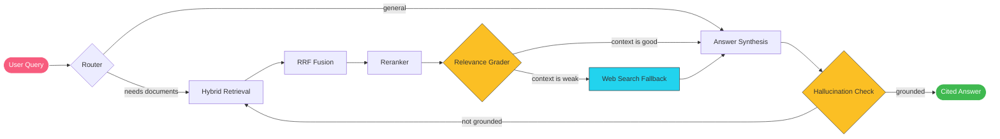
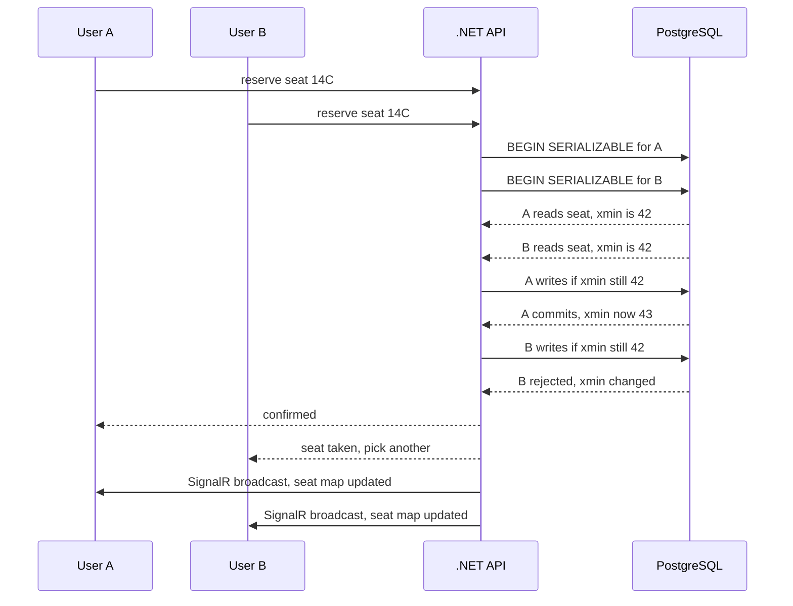
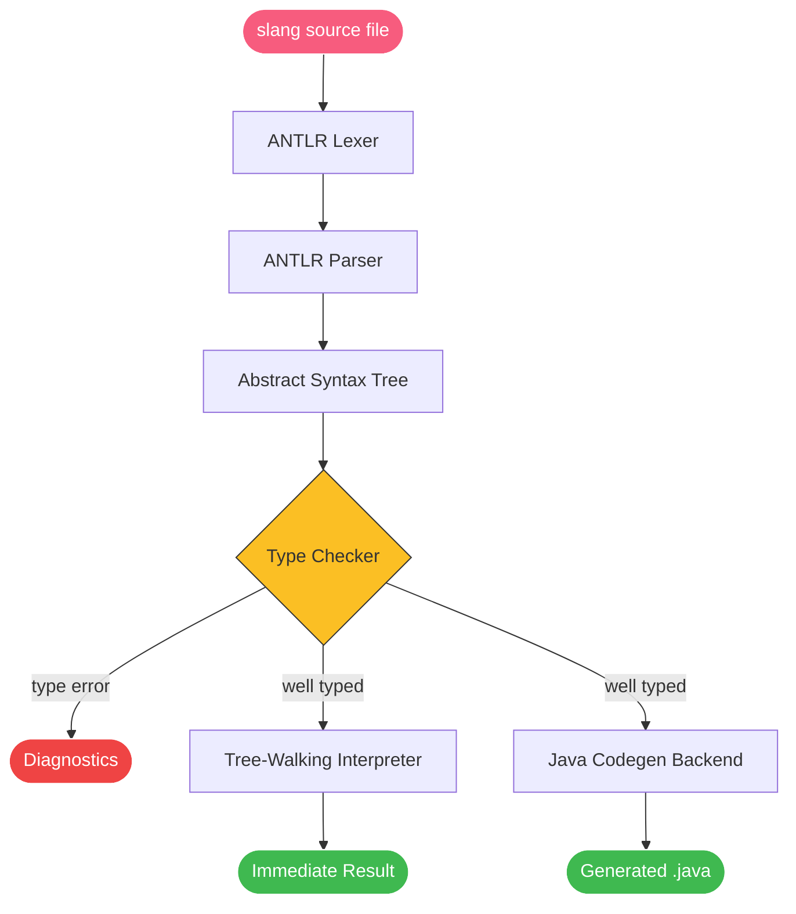
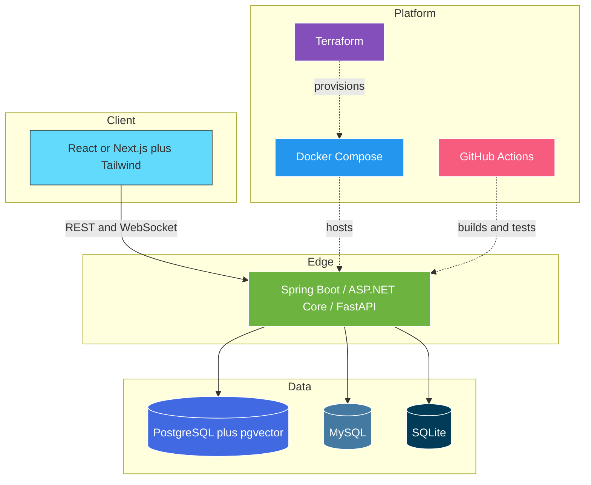
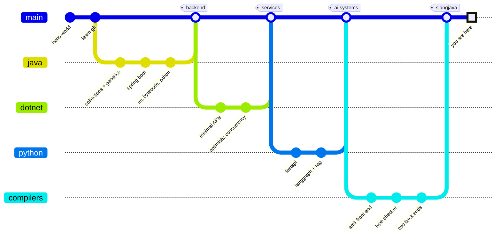
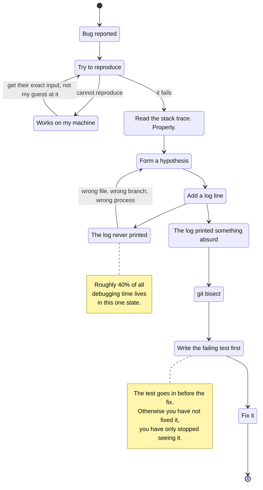
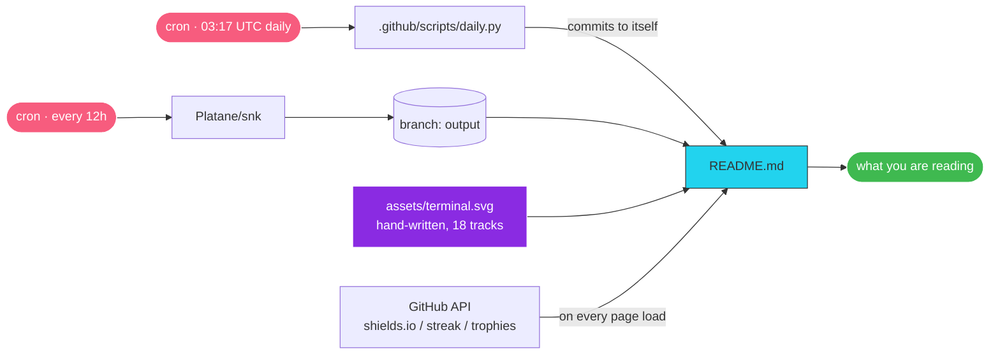

<div align="center">

<a href="https://github.com/Amithkrishna29z">
  
</a>

<br><br>


<br><br>


<br><br>

**👇 Click anything below to expand it.** There are four bug-hunting puzzles, a 2 AM incident you have to survive, and at least one easter egg. This README is meant to be played with, not scrolled past.

</div>


## 🧭 Start Here — Pick Your Path

<table>
<tr>
<td width="33%" valign="top">

<details>
<summary><b>👔 Hiring / Recruiting</b></summary>

<br>

**TL;DR** — Backend-leaning full-stack developer. Java & .NET for services, Python for AI systems, TypeScript on the front.

**Strongest evidence of depth:**
1. [SLangJava](https://github.com/Amithkrishna29z/SLangJava) — a working compiler, 174 tests pinned against a reference implementation
2. [dotnet-seat-wave](https://github.com/Amithkrishna29z/dotnet-seat-wave) — real concurrency control, not CRUD
3. [documind](https://github.com/Amithkrishna29z/documind-multi-agent-document-intelligence) — production-shaped AI architecture

**Also worth knowing:** 98 public repos across 12 languages, consistently maintained since 2022.

[](mailto:amithkrishna29z@gmail.com)

</details>

</td>
<td width="33%" valign="top">

<details>
<summary><b>🧑‍💻 Fellow Engineer</b></summary>

<br>

**The ones with actual ideas in them:**

- **[SLangJava](https://github.com/Amithkrishna29z/SLangJava)** — ANTLR front end → type checker → tree-walking interpreter → Java codegen. Porting a compiler teaches you where a spec is actually ambiguous.
- **[mini-rate-limiter](https://github.com/Amithkrishna29z/mini-rate-limiter)** — token bucket, thread-safe, small enough to read in one sitting.
- **[jython-plugin-engine](https://github.com/Amithkrishna29z/jython-plugin-engine)** — embedding a Python runtime in a JVM app for hot-loadable plugins.
- **[java-byteCode-engineering](https://github.com/Amithkrishna29z/java-byteCode-engineering)** — bytecode manipulation.
- **[java-jni](https://github.com/Amithkrishna29z/java-jni)** — crossing the JVM/native boundary.

</details>

</td>
<td width="33%" valign="top">

<details>
<summary><b>🍿 Just Browsing</b></summary>

<br>

My GitHub bio is `git commit -m "Hope this works"` and I stand by it.

**Fun corners of this account:**
- [story](https://github.com/Amithkrishna29z/story) — described, in earnest, as "my masterpiece"
- [learn-git](https://github.com/Amithkrishna29z/learn-git) — "a test to learn git"
- [express-digi](https://github.com/Amithkrishna29z/express-digi) — "just a test repo"
- [7-levels-of-knowledge](https://github.com/Amithkrishna29z/7-levels-of-knowledge)
- [free-medium](https://github.com/Amithkrishna29z/free-medium)

Somewhere in these 98 repos is a `volkswagen` repo. I'm not explaining it.

</details>

</td>
</tr>
</table>


## 🎲 This Section Rewrites Itself

<div align="center">

<!-- DAILY:START -->

<table><tr><td width="55%" valign="top">

**🎲 Repo roulette — 2026-09-17**

### [mini-rate-limiter](https://github.com/Amithkrishna29z/mini-rate-limiter)

Token bucket, thread-safe, small enough to read in one sitting.

`Java · JUnit 5`

</td><td width="45%" valign="top">

**💡 Something I believe today**

> If the retry has no jitter, you did not build a retry — you built a thundering herd.

<sub>Rotated by <a href="https://github.com/Amithkrishna29z/Amithkrishna29z/blob/main/.github/workflows/daily.yml">a cron job</a>, not by hand. Come back tomorrow.</sub>

</td></tr></table>

<!-- DAILY:END -->

<sub>A GitHub Action runs at 03:17 UTC, picks a repo and a line, edits this file, and pushes. The README you are reading is a build artifact of itself.</sub>

</div>


## 🐍 Watch My Commits Get Eaten

<div align="center">

<picture>
  <source media="(prefers-color-scheme: dark)" srcset="https://raw.githubusercontent.com/Amithkrishna29z/Amithkrishna29z/output/snake-dark.svg"/>
  <source media="(prefers-color-scheme: light)" srcset="https://raw.githubusercontent.com/Amithkrishna29z/Amithkrishna29z/output/snake-light.svg"/>
  
</picture>

<sub>🔄 Regenerated automatically every 12 hours by <a href="https://github.com/Amithkrishna29z/Amithkrishna29z/actions">GitHub Actions</a> — this image is never the same twice.</sub>

</div>


## 🚀 Featured Projects

> Each card below has an expandable deep-dive showing how the thing actually works.

<table>
<tr>
<td width="50%" valign="top">

### 🧠 [documind](https://github.com/Amithkrishna29z/documind-multi-agent-document-intelligence)
Multi-agent RAG platform with a corrective retrieval pipeline and streamed, cited answers.


</td>
<td width="50%" valign="top">

### 🎟️ [dotnet-seat-wave](https://github.com/Amithkrishna29z/dotnet-seat-wave)
Event ticketing with a seat engine that refuses to double-book under load.


</td>
</tr>
</table>

<details>
<summary><b>🔍 How documind's corrective-RAG pipeline works</b></summary>

<br>

A plain RAG system answers confidently from bad context. This one grades its own retrieval and backs out when the context is weak.



**The two decision points are the whole idea.** The *relevance grader* catches weak retrieval before it reaches the model, and the *hallucination check* catches ungrounded output before it reaches the user — looping back rather than shipping a confident guess.

Stack: LangGraph orchestration · FastAPI · PostgreSQL + pgvector · typed React/Vite frontend with a live agent-status timeline.

</details>

<details>
<summary><b>🔍 How seat-wave prevents double-booked seats</b></summary>

<br>

Two people click the same seat in the same millisecond. Exactly one may win.



`SERIALIZABLE` isolation plus PostgreSQL's `xmin` system column gives optimistic concurrency without a distributed lock. Losers get a clean rejection, and every connected client's seat map updates live over SignalR.

</details>

<table>
<tr>
<td width="50%" valign="top">

### ⚙️ [SLangJava](https://github.com/Amithkrishna29z/SLangJava)
Java port of the SlangSharp (ARLang) compiler — **174 tests** pinned against the original .NET implementation.


</td>
<td width="50%" valign="top">

### 🗂️ [realtime-kanban](https://github.com/Amithkrishna29z/mern-realtime-collaborative-kanban-board)
Collaborative Trello-style board with live multi-user sync over WebSockets.


</td>
</tr>
<tr>
<td width="50%" valign="top">

### 🛠️ [springcli](https://github.com/Amithkrishna29z/springcli)
Cross-platform Java 21 CLI that scaffolds Spring Boot projects via the Spring Initializr API.


</td>
<td width="50%" valign="top">

### 🚦 [mini-rate-limiter](https://github.com/Amithkrishna29z/mini-rate-limiter)
Thread-safe token-bucket rate limiter — a clean concurrency primitive, fully tested.


</td>
</tr>
</table>

<details>
<summary><b>🔍 How a compiler fits together front-to-back (SLangJava)</b></summary>

<br>



One front end, two back ends: the same type-checked AST either runs immediately through the interpreter or lowers to Java source. The 174 tests exist because a port is only correct if it disagrees with the original *nowhere*.

</details>

<details>
<summary><b>📂 Browse all 98 repositories by theme</b></summary>

<br>

> **🔌 Backend & APIs** — [spendlog](https://github.com/Amithkrishna29z/spendlog) · [dotnet-minimal-api-gamestore](https://github.com/Amithkrishna29z/dotnet-minimal-api-gamestore) · [rust-todo-api](https://github.com/Amithkrishna29z/rust-todo-api) · [dotnet-url-shortener](https://github.com/Amithkrishna29z/dotnet-url-shortener) · [python-fast-api-url-shortener-analytics](https://github.com/Amithkrishna29z/python-fast-api-url-shortener-analytics) · [springboot-graphql](https://github.com/Amithkrishna29z/springboot-graphql) · [java-grpc](https://github.com/Amithkrishna29z/java-grpc)

> **🧬 Systems & internals** — [linux-internals](https://github.com/Amithkrishna29z/linux-internals) · [connect-c-to-sqlite](https://github.com/Amithkrishna29z/connect-c-to-sqlite) · [java-jni](https://github.com/Amithkrishna29z/java-jni) · [java-byteCode-engineering](https://github.com/Amithkrishna29z/java-byteCode-engineering) · [tiny-c-plus-plus](https://github.com/Amithkrishna29z/tiny-c-plus-plus) · [java-CompletableFuture](https://github.com/Amithkrishna29z/java-CompletableFuture)

> **🏛️ Architecture & extensibility** — [jython-plugin-engine](https://github.com/Amithkrishna29z/jython-plugin-engine) · [java-plugin-architecture](https://github.com/Amithkrishna29z/java-plugin-architecture) · [clean-architecture](https://github.com/Amithkrishna29z/clean-architecture) · [design-patterns](https://github.com/Amithkrishna29z/design-patterns) · [solid-principles](https://github.com/Amithkrishna29z/solid-principles)

> **🤖 AI & tooling** — [python-google-search-mcp-server](https://github.com/Amithkrishna29z/python-google-search-mcp-server) · [support-triage-bot](https://github.com/Amithkrishna29z/support-triage-bot) · [devStack-doctor](https://github.com/Amithkrishna29z/devStack-doctor) · [next-expense-tracker-ai](https://github.com/Amithkrishna29z/next-expense-tracker-ai)

> **☁️ DevOps & security** — [devops-terraform](https://github.com/Amithkrishna29z/devops-terraform) · [devops-malayalam-docker](https://github.com/Amithkrishna29z/devops-malayalam-docker) · [ctfd-whale-integrated](https://github.com/Amithkrishna29z/ctfd-whale-integrated)

</details>


## 🕵️ Spot the Bug

> Four snippets. Each one compiles, passes a happy-path test, and is wrong.
> They are all mistakes I have personally shipped. Hints and answers are one click away — no peeking until you've committed to a theory.

<details>
<summary><b>🧩 Puzzle 1 · Java — this rate limiter slowly starves every caller. Why?</b></summary>

<br>

```java
final class TokenBucket {
    private final long capacity;
    private final long refillPerSecond;
    private long tokens;
    private long lastRefillMs;

    synchronized boolean tryAcquire() {
        long now = System.currentTimeMillis();
        long elapsedSeconds = (now - lastRefillMs) / 1000;

        tokens = Math.min(capacity, tokens + elapsedSeconds * refillPerSecond);
        lastRefillMs = now;

        if (tokens > 0) { tokens--; return true; }
        return false;
    }
}
```

<details>
<summary>💡 Hint</summary>

<br>

It behaves perfectly when you call it once per second. Now call it two hundred times per second and watch the bucket never refill.

</details>

<details>
<summary>✅ Answer</summary>

<br>

**`lastRefillMs = now` throws away the remainder.**

`elapsedSeconds` is integer division. If two calls arrive 4 ms apart, `elapsedSeconds` is `0` — no tokens are added — but the clock is still advanced to `now`. Every call resets the timer before a full second can ever accumulate. Under sustained load the bucket drains once and never refills again.

The fix is to only consume the time you actually credited:

```java
long elapsedSeconds = (now - lastRefillMs) / 1000;
if (elapsedSeconds > 0) {
    tokens = Math.min(capacity, tokens + elapsedSeconds * refillPerSecond);
    lastRefillMs += elapsedSeconds * 1000;   // keep the remainder
}
```

Better still, track nanoseconds from `System.nanoTime()` and refill fractionally — wall-clock time can jump backwards, and `currentTimeMillis()` is not monotonic. See [mini-rate-limiter](https://github.com/Amithkrishna29z/mini-rate-limiter).

</details>

</details>

<details>
<summary><b>🧩 Puzzle 2 · TypeScript — this function reports that nothing ever fails. It is lying.</b></summary>

<br>

```ts
async function reindexAll(docs: Doc[]): Promise<string[]> {
  const failed: string[] = [];

  docs.forEach(async (doc) => {
    try {
      await embedAndStore(doc);
    } catch {
      failed.push(doc.id);
    }
  });

  return failed;
}
```

<details>
<summary>💡 Hint</summary>

<br>

What does `Array.prototype.forEach` do with the value its callback returns?

</details>

<details>
<summary>✅ Answer</summary>

<br>

**`forEach` ignores the returned promise, so nothing is ever awaited.**

`reindexAll` returns `failed` while every `embedAndStore` call is still in flight — the array is always empty. Worse, the function resolves before the work is done, so the caller believes indexing finished. And because nobody holds those promises, a rejection that escapes the `catch` becomes an unhandled rejection that can take the process down in Node.

Two honest fixes, depending on what you actually want:

```ts
// sequential, back-pressure friendly
for (const doc of docs) {
  try { await embedAndStore(doc); } catch { failed.push(doc.id); }
}

// concurrent, and actually awaited
const results = await Promise.allSettled(docs.map(embedAndStore));
results.forEach((r, i) => r.status === "rejected" && failed.push(docs[i].id));
```

`forEach` is the one array method that silently swallows async callbacks. `map` at least hands you the promises back.

</details>

</details>

<details>
<summary><b>🧩 Puzzle 3 · Python — under load, tenant A starts getting tenant B's documents.</b></summary>

<br>

```python
class Retriever:
    def __init__(self, namespace: str, store: VectorStore):
        self.namespace = namespace
        self.store = store

    def search(self, query: str, filters: dict = {}, top_k: int = 5):
        filters["namespace"] = self.namespace
        return self.store.query(query, filters=filters, top_k=top_k)
```

<details>
<summary>💡 Hint</summary>

<br>

How many times is that `{}` evaluated? Count carefully.

</details>

<details>
<summary>✅ Answer</summary>

<br>

**The default `{}` is created once, when the `def` is executed — and shared by every call on every instance.**

`Retriever("tenant-a", ...)` and `Retriever("tenant-b", ...)` are different objects, but when both call `search()` without filters they mutate *the same dictionary*. Under a thread pool or an async event loop, tenant B's `search` can overwrite `namespace` in the window between tenant A writing it and `store.query` reading it. The result is a cross-tenant data leak that no single-threaded test will ever reproduce.

```python
def search(self, query: str, filters: dict | None = None, top_k: int = 5):
    filters = {**(filters or {}), "namespace": self.namespace}
    return self.store.query(query, filters=filters, top_k=top_k)
```

Two rules are doing work here: never use a mutable default, and never mutate an argument the caller still owns.

</details>

</details>

<details>
<summary><b>🧩 Puzzle 4 · C# — two people just bought seat 14C. The code looks fine.</b></summary>

<br>

```csharp
public async Task<bool> ReserveAsync(int seatId, Guid userId)
{
    var seat = await _db.Seats.FindAsync(seatId);

    if (seat.Status != SeatStatus.Free)
        return false;

    seat.Status = SeatStatus.Held;
    seat.HeldBy = userId;

    await _db.SaveChangesAsync();
    return true;
}
```

<details>
<summary>💡 Hint</summary>

<br>

Draw the timeline for two requests that both reach the `if` before either reaches `SaveChangesAsync`.

</details>

<details>
<summary>✅ Answer</summary>

<br>

**Check-then-act with nothing defending the gap.** A textbook time-of-check-to-time-of-use race.

Both requests read `Free`. Both pass the `if`. Both write `Held`. Both saves succeed, because EF Core generates `UPDATE seats SET ... WHERE id = @id` with no condition on the value it read. Last write wins, two people hold one seat, and the failure only surfaces at the door.

The fix is to make the database enforce what the `if` was only pretending to enforce — map PostgreSQL's `xmin` system column as a concurrency token, so the generated SQL becomes `... WHERE id = @id AND xmin = @original`:

```csharp
modelBuilder.Entity<Seat>().UseXminAsConcurrencyToken();
```

```csharp
try
{
    await _db.SaveChangesAsync();
    return true;
}
catch (DbUpdateConcurrencyException)
{
    return false;      // somebody beat us to it — tell the user honestly
}
```

Now exactly one writer wins and the loser gets a clean rejection instead of a corrupt booking. This is the mechanism behind the [seat-wave](https://github.com/Amithkrishna29z/dotnet-seat-wave) deep-dive above.

</details>

</details>

<br>

<div align="center">

| Solved | Verdict |
| :---: | :--- |
| **0–1** | Honest. Most of these cost me a production incident to learn. |
| **2–3** | You have been on call. |
| **4** | Please [open an issue](https://github.com/Amithkrishna29z/Amithkrishna29z/issues/new?title=%F0%9F%95%B5%EF%B8%8F%204%2F4&body=I%20got%20all%20four.%20Here%20is%20one%20of%20mine%3A%0A%0A%60%60%60%0A%0A%60%60%60%0A%0A**Where%20it%20breaks%3A**%0A) and bring one of your own. |

</div>


## 🚨 It Is 2 AM. Can You Save Production?

> A choose-your-own-adventure. Every branch is a real failure mode; one of them is the night I actually lived through.
> **Expand a choice to see what happens next.** There are no wrong answers — only expensive ones.

> **02:14.** Your phone lights the ceiling. `p99 latency 8.4s` · `error rate 12% and climbing` · checkout is timing out.
> You deployed four hours ago and went to bed pleased with yourself.

<details>
<summary><b>🅰️ Roll it back. Right now. Questions in the morning.</b></summary>

<br>

Rollback completes at 02:19. Latency drops. Errors clear. The graphs go flat and green and beautiful.

<details>
<summary>→ Go back to sleep. It is fixed.</summary>

<br>

**02:14 the next night.** Same page. Same graphs. Same you, angrier.

The deploy was not the cause — it was the *trigger*. A background migration started on deploy, ran for hours, and held a lock that only became contentious once European morning traffic arrived. Rolling back stopped the migration midway. Tonight it resumed.

> **Ending: The Tourniquet.** A rollback stops the bleeding. It never tells you where the wound is. You bought eight hours and paid for them with the same eight hours tomorrow.

</details>

<details>
<summary>→ Stay up. Find out what the deploy actually changed.</summary>

<br>

You diff the release. Forty-one commits, one of which adds an index concurrently on a 40-million-row table. You check `pg_stat_activity` on the rolled-back primary: the migration is still there, still running, still holding its lock.

You kill it deliberately, and reschedule it for Sunday 04:00 with a statement timeout and a plan.

> **Ending: Boring and Correct.** 🏆 You lost a night of sleep and gained a root cause. That is the trade that compounds.

</details>

</details>

<details>
<summary><b>🅱️ Touch nothing yet. Sixty seconds on the dashboards first.</b></summary>

<br>

You give yourself one minute before touching a single control.

```
db.pool.connections.active   100 / 100   ██████████  saturated
db.pool.checkout.wait.p99    7.9s        <-- there it is
app.cpu                      11%
app.memory                   38%
```

The application is almost idle. It is not slow — it is *queuing*. Every request is waiting for a database connection that nobody is giving back.

<details>
<summary>→ Raise the pool size to 500 and redeploy.</summary>

<br>

**02:31.** Pods come back with the bigger pool. For ninety seconds it looks like genius.

Then PostgreSQL hits `max_connections`, starts refusing new connections outright, and the health checks — which also need a connection — begin to fail. Kubernetes dutifully restarts every pod. Nothing can connect. The site goes from slow to *down*.

> **Ending: More Rope.** Pool exhaustion is a symptom of connections being held too long, never of the pool being too small. You just handed a leak a bigger bucket.

</details>

<details>
<summary>→ Find out who is holding the connections.</summary>

<br>

```sql
SELECT state, wait_event_type, query, now() - xact_start AS held
FROM pg_stat_activity
WHERE state <> 'idle'
ORDER BY held DESC
LIMIT 5;
```

Every long-lived transaction is sitting in the same place: `idle in transaction`, 6 to 9 seconds each, all from `POST /checkout`. The queries are fast. The transaction is not.

You open the handler. There it is — a call to the payment provider, *inside* the transaction.

```csharp
using var tx = await _db.BeginTransactionAsync();
var order  = await CreateOrderAsync(cart);
var charge = await _payments.ChargeAsync(order);   // network call, holding a DB connection
await _db.SaveChangesAsync();
await tx.CommitAsync();
```

The provider started answering in 6 seconds instead of 200 ms tonight. Your database connections are now pinned to somebody else's latency.

<details>
<summary>→ Add a 2-second timeout to the payment call.</summary>

<br>

It works. Pool pressure drops immediately, the site recovers, and you are back in bed by 03:10.

You have also started cancelling real payment requests mid-flight without knowing whether the charge went through. Tomorrow's problem is a reconciliation problem, and it involves money.

> **Ending: Traded Down.** A timeout on a non-idempotent call is a correctness bug with a nicer graph. Right instinct, wrong layer.

</details>

<details>
<summary>→ Move the network call out of the transaction entirely.</summary>

<br>

You restructure it. Write the order as `Pending` and commit. Call the payment provider holding no transaction at all, with an idempotency key. Open a second, short transaction to record the outcome.

```csharp
var order  = await CreateOrderAsync(cart);                              // tx 1: commits immediately
var charge = await _payments.ChargeAsync(order, idempotencyKey: order.Id);
await MarkAsync(order, charge);                                         // tx 2: short, safe to retry
```

Connection hold time drops from 8 seconds to 12 milliseconds. The provider can be as slow as it likes now — it costs you a worker, not the database.

> **Ending: The Actual Fix.** 🏆 *Never hold a database transaction across a network call you do not control.* This is the one I lived. It took me until 04:40, and I have not made it since.

</details>

</details>

</details>

<details>
<summary><b>🅲 Restart the pods. That usually works.</b></summary>

<br>

It usually does. It does this time too — for about six minutes.

Then they all come back at once, every one reconnecting simultaneously, and the reconnect storm hits the database harder than the original problem did. Latency is now worse than when you were woken up.

<details>
<summary>→ Restart them again. Harder.</summary>

<br>

> **Ending: The Loop.** You are now the thundering herd. Somewhere a retry with no jitter is agreeing with you enthusiastically. See you at 02:14 tomorrow.

</details>

<details>
<summary>→ Stop. Go and look at the dashboards.</summary>

<br>

Correct call — twenty minutes late, but correct. **Go back and take path 🅱️.** The connection pool had been sitting at 100/100 the entire time and would have told you so at 02:15.

</details>

</details>

<br>

<div align="center">
<sub>If any of that felt uncomfortably familiar, you and I would probably get on. <a href="https://github.com/Amithkrishna29z/Amithkrishna29z/issues/new?title=%F0%9F%9A%A8%20My%202AM%20story&body=**What%20broke%3A**%0A%0A**What%20I%20tried%20first%3A**%0A%0A**What%20it%20actually%20was%3A**%0A">Tell me yours.</a></sub>
</div>


## 🎨 Tech Stack

<div align="center">

**Languages & Runtimes**

[](https://skillicons.dev)

**Frameworks**

[](https://skillicons.dev)

**Data & Infrastructure**

[](https://skillicons.dev)

</div>

<details>
<summary><b>🗺️ See how these fit together in a real service</b></summary>

<br>



</details>


## 🌱 How I Got Here, As A Commit Graph

<div align="center">



</div>

Every branch above started as "I do not really understand how this works," which is still the only reason I start anything. The branches that got merged are the ones where I got far enough to be useful to someone else.

<details>
<summary><b>🐛 And here is how I actually debug — honestly</b></summary>

<br>



The loop that matters is `Silence -> Hypothesis`. A log line that does not appear is not a dead end — it is the single most informative result you can get, because it means your model of which code is running is wrong, and that is a much bigger bug than the one you were chasing.

</details>


## 📊 By The Numbers

<div align="center">


<br><br>


<br>


<br>

<sub>That quote changes every time this page is loaded. Refresh and see.</sub>

</div>

<details open>
<summary><b>🧮 Where the code actually lives</b></summary>

<br>

<!-- Computed from the GitHub API across all 97 non-fork repos.
     Vendored third-party source excluded: the SQLite amalgamation in
     connect-c-to-sqlite is ~10 MB of C and would otherwise dominate. -->

| Language | Repos | Share of repos | Code volume |
| :--- | ---: | :--- | ---: |
|  | **41** | `████████████████████` | 16.8% |
|  | **12** | `██████░░░░░░░░░░░░░░` | 20.8% |
|  | **10** | `█████░░░░░░░░░░░░░░░` | 10.2% |
|  | **8** | `████░░░░░░░░░░░░░░░░` | **40.0%** |
|  | **4** | `██░░░░░░░░░░░░░░░░░░` | 8.4% |
|  | **1** | `█░░░░░░░░░░░░░░░░░░░` | — |
|  | **1** | `█░░░░░░░░░░░░░░░░░░░` | 0.5% |
|  | **1** | `█░░░░░░░░░░░░░░░░░░░` | — |

`Java` is where the breadth is · `Python` is where the big systems are

<details>
<summary><i>Why these two columns disagree</i></summary>

<br>

Because they measure different things, and showing only one of them would mislead you.

**Repos** counts projects — Java wins, because most of my learning-by-building happens there in small focused repos.

**Code volume** counts bytes — Python wins, because the largest single systems (documind, ctfd-whale-integrated) are Python.

Worth noting: the raw GitHub API says I am a **62% C developer**. I am not. `connect-c-to-sqlite` vendors the SQLite amalgamation — 10,063,013 of 10,064,587 total C bytes is someone else's code. Automated language cards on most profiles quietly include numbers like that. This table excludes them.

</details>

</details>


## 🛠️ How This README Works

> You are looking at a small build system. Three of the things on this page were not written by hand, and one of them was written entirely by hand for exactly the reason you would not expect.

<div align="center">



</div>

| Part | How it is made | Source |
| :--- | :--- | :--- |
| 🐍 Contribution snake | A scheduled Action renders my contribution grid into two themed SVGs and force-pushes them to an orphan `output` branch. The README never changes; the image behind it does. | [`snake.yml`](https://github.com/Amithkrishna29z/Amithkrishna29z/blob/main/.github/workflows/snake.yml) |
| 🎲 Daily block | A cron job runs a 60-line Python script that rewrites the text between two HTML comment markers and commits the result. The README modifies itself, on a schedule, in place. | [`daily.py`](https://github.com/Amithkrishna29z/Amithkrishna29z/blob/main/.github/scripts/daily.py) |
| 💻 Animated terminal | No library, no GIF, no third-party render service. A generated SVG with 18 SMIL `<animate>` tracks — 8 animating `clipPath` widths so text appears one character at a time, 4 moving the cursor along with it, 6 handling blink and reveal — on a 14.5-second loop. Roughly 10 KB, and it degrades to a static terminal if animation is blocked. | [`terminal.svg`](https://github.com/Amithkrishna29z/Amithkrishna29z/blob/main/assets/terminal.svg) · [generator](https://github.com/Amithkrishna29z/Amithkrishna29z/blob/main/assets/gen_terminal.py) |
| 🏅 Achievement cards | Six numbers pulled straight from the GitHub API and drawn into an SVG in this repo. These used to come from a trophy service, which one day started answering `HTTP 402 DEPLOYMENT_DISABLED` and turned into a broken image on my own profile — exactly the failure described below. Now the worst case is stale numbers, not a broken image. **Commits** counts default-branch commits in my own public repos, summed per repo — not the Search API, which answers `736` to my own token and `394` to the one Actions runs under, and would have made the number flip-flop daily. | [`achievements.svg`](https://github.com/Amithkrishna29z/Amithkrishna29z/blob/main/assets/achievements.svg) · [generator](https://github.com/Amithkrishna29z/Amithkrishna29z/blob/main/assets/gen_stats.py) |
| 📊 Language table | Computed once from the GitHub API, then hand-corrected — because the raw numbers say I am a 62% C developer and that is a vendored SQLite amalgamation, not me. | the table above |

<details>
<summary><b>🤔 Why hand-write the SVG instead of using a typing-SVG service?</b></summary>

<br>

Two reasons, one principled and one petty.

**The principled one:** every third-party badge on this page is a dependency on somebody else's uptime. When `some-cool-svg.vercel.app` gets rate-limited or quietly shuts down, the profile it renders on turns into a row of broken-image icons and the owner is usually the last to find out. I did not have to wait long to be proved right: the trophy row above was a `.vercel.app` service until it started returning `HTTP 402 DEPLOYMENT_DISABLED`, and I found out because someone told me the image was broken. It is now generated from the GitHub API and committed to this repo. The terminal is a file in this repository. It renders as long as GitHub does.

**The petty one:** getting a character-by-character reveal out of declarative SVG is a genuinely fun constraint. There is no JavaScript in a GitHub-rendered image, so the typing has to be a `clipPath` rectangle whose `width` is animated through discrete per-character values on a single looping timeline, with a cursor rectangle whose `x` is animated through the same value list so it rides along with the text. The keyframe arithmetic is annoying enough that I generated it with [a script](https://github.com/Amithkrishna29z/Amithkrishna29z/blob/main/assets/gen_terminal.py) rather than trusting myself with it.

</details>


## 💬 Say Something

<div align="center">

**Every button below opens a pre-filled GitHub issue — one click, nothing to compose.**

<br>

[](https://github.com/Amithkrishna29z/Amithkrishna29z/issues/new?title=%F0%9F%91%8B%20Hi%20Amith!&body=Hi%20Amith%20%E2%80%94%20found%20your%20profile%20and%20wanted%20to%20say%20hello.%0A%0A**Who%20I%20am%3A**%0A%0A**What%20caught%20my%20eye%3A**%0A)
[](https://github.com/Amithkrishna29z/Amithkrishna29z/issues/new?title=%E2%9D%93%20Question%3A%20&body=**My%20question%3A**%0A%0A%0A**Context%20(optional)%3A**%0A)
[](https://github.com/Amithkrishna29z/Amithkrishna29z/issues/new?title=%F0%9F%A4%9D%20Collaboration%3A%20&body=**The%20idea%3A**%0A%0A%0A**Stack%20involved%3A**%0A%0A%0A**Where%20it%20lives%3A**%0A)
[](https://github.com/Amithkrishna29z/Amithkrishna29z/issues/new?title=%F0%9F%90%9B%20Bug%20in%3A%20&body=**Which%20repo%3A**%0A%0A**What%20happened%3A**%0A%0A**What%20I%20expected%3A**%0A%0A**Steps%20to%20reproduce%3A**%0A1.%0A2.%0A)

<br>

[](https://github.com/Amithkrishna29z)
[](mailto:amithkrishna29z@gmail.com)

<!-- Add your own links:
[](https://linkedin.com/in/YOUR-HANDLE)
[](https://x.com/YOUR-HANDLE)
-->

<br>

⭐️ *If any of my projects helped you, a star means a lot!*

</div>

<div align="center">

<details>
<summary>🥚</summary>

<br>

<details>
<summary>Well, you clicked it. Keep going.</summary>

<br>

<details>
<summary>You are the kind of person who reads the source of things.</summary>

<br>

<details>
<summary>Nearly there. This is the last one, honestly.</summary>

<br>

<div align="left">

```
        ______________________________
       /                              \
      |    $ git blame --everything    |
      |                                |
      |    Amith    2 years ago        |
      |    Amith    2 years ago        |
      |    Amith    14 minutes ago     |
      \______________________________/
                   \
                    \   ^__^
                     \  (oo)\_______
                        (__)\       )\/\
                            ||----w |
                            ||     ||
```

</div>

**You found it.**

Four nested clicks is more curiosity than most people bring to a README, and curiosity is the entire job. So here is a real offer, not a joke ending:

[](https://github.com/Amithkrishna29z/Amithkrishna29z/issues/new?title=%F0%9F%A5%9A&body=I%20found%20the%20egg.%0A%0A**Something%20I%27m%20stuck%20on%2C%20curious%20about%2C%20or%20building%3A**%0A%0A)

Put anything in it — a question, something you are stuck on, a bug in one of my repos, an idea you want a second opinion on. Issues that start with 🥚 get answered first, and they get a real answer rather than a polite one.

</details>
</details>
</details>
</details>

<sub>There is exactly one egg. There is also something for people who read raw Markdown — you are looking in the right file.</sub>

</div>


<!--
     ______________________________________________________________
    |                                                              |
    |   You are reading the raw Markdown. Of course you are.       |
    |                                                              |
    |   Since you are here, the honest version of this profile:    |
    |                                                              |
    |   - Most of those 98 repos are me learning something in      |
    |     public and not deleting the evidence afterwards.         |
    |   - The four bugs in "Spot the Bug" are real. I shipped      |
    |     every one of them. The rate limiter one took eleven      |
    |     days to find.                                            |
    |   - Path B of the 2 AM story is the one that happened.       |
    |     The payment provider was fine by morning. I was not.     |
    |   - This README is version-controlled, linted by nobody,     |
    |     and rewritten by a cron job at 03:17 UTC.                |
    |                                                              |
    |   If you read this far, mention "03:17" in an issue and      |
    |   I will know exactly how you got there.                     |
    |______________________________________________________________|
-->
